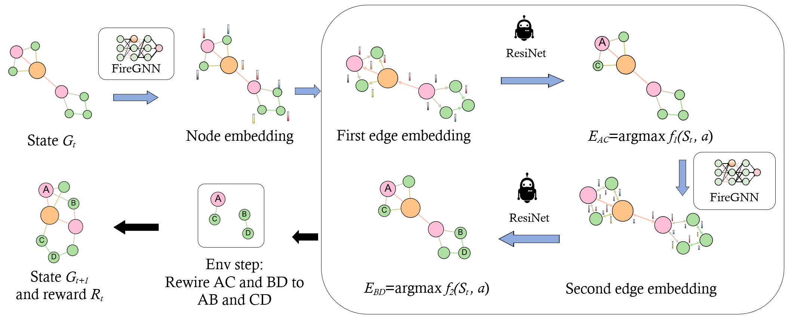

# Edge Rewiring Goes Neural: Boosting Network Resilience via Policy Gradient


This repository is the official PyTorch implementation of "Edge Rewiring Goes Neural: Boosting Network Resilience via Policy Gradient".

[Shanchao Yang](https://yangysc.github.io/), Kaili Ma, [Baoxiang Wang](https://bxiangwang.github.io/), [Hongyuan Zha](https://sds.cuhk.edu.cn/en/teacher/65), [Edge Rewiring Goes Neural: Boosting Network Resilience via Policy Gradient](https://arxiv.org/abs/2110.09035)


## Installation

- CUDA 11.+

- Create Python environment (3.+), using `anaconda` is recommended:	

  ```
  conda create -n my-resinet-env python=3.8
  conda activate my-resinet-env
  ```

- Install [Pytorch](https://pytorch.org/get-started/locally/)  using `anaconda`

  ```
  conda install pytorch torchvision torchaudio cudatoolkit=11.1 -c pytorch -c nvidia
  ```

  or using `Pip`

  ```
  pip install torch==1.9.1+cu111 torchvision==0.10.1+cu111 torchaudio==0.9.1 -f https://download.pytorch.org/whl/torch_stable.html
  ```


- Install  networkx, tensorflow, tensorboardX, numpy, numba, dm-tree, gym, dgl, pyg

  ```
  pip install networkx==2.5
  pip install tensorflow-gpu==2.3.0
  pip install numpy==1.20.3
  pip install numba==0.52.0
  pip install gym==0.18.0
  pip install tabulate
  pip install dm-tree
  pip install lz4
  pip install opencv-python
  pip install tensorboardX
  pip install dgl-cu111 -f https://data.dgl.ai/wheels/repo.html
  pip install torch-scatter -f https://pytorch-geometric.com/whl/torch-1.9.0+cu111.html
  pip install torch-sparse -f https://pytorch-geometric.com/whl/torch-1.9.0+cu111.html
  pip install torch-cluster -f https://pytorch-geometric.com/whl/torch-1.9.0+cu111.html
  pip install torch-spline-conv -f https://pytorch-geometric.com/whl/torch-1.9.0+cu111.html
  pip install torch-geometric
  ```

- Install [ray](https://docs.ray.io/en/latest/rllib.html)
    - Use the specific commit version of ray `8a066474d44110f6fddd16618351fe6317dd7e03`

        For Linux:

      ```
      pip install -U https://s3-us-west-2.amazonaws.com/ray-wheels/master/8a066474d44110f6fddd16618351fe6317dd7e03/ray-2.0.0.dev0-cp38-cp38-manylinux2014_x86_64.whl
      ```
      For Windows:
      ```
      pip install -U https://s3-us-west-2.amazonaws.com/ray-wheels/master/8a066474d44110f6fddd16618351fe6317dd7e03/ray-2.0.0.dev0-cp38-cp38-win_amd64.whl
      ```

  - Download our repository, which includes the source codes of ray and ResiNet.

      ```
      git clone https://github.com/yangysc/ResiNet.git
      ```

  - Set the symlink of rllib to use our custom rllib (remeber to remove these symlinks before uninstalling ray!)
    ```
    python ResiNet/ray-master/python/ray/setup-dev.py -y
    ```

***

## Code description
There are 4 important file folders.
- **Environment**: `ResiNet/ray-master/rllib/examples/env/`
  - `graphenv.py` is the edge rewiring environment based on OpenAI gym.
  - `parametric_actions_graph.py` is the env wrapper that accesses the graph from `graphenv.py` and returns the `dict` observation.
  - `utils_.py` defines the reward calculation strategy.
  - `get_mask.py` defines the action mask calculation for selecting the first edge and the second 
  edge.
  - `datasets` is the folder for providing training and test datasets. The following table (Table 2, Page 17 in the paper) records the statistics of graphs used in the paper.

    | Dataset  | Node | Edge | Action Space Size | 
    | ------------- | ------------- | ------------- | ------------- |
    | BA-15  | 15  | 54   | 5832
    | BA-50  | 50  |   192  |73728
    | BA-100  | 100    |    392 | 307328
    | EU  |  217  |   640   | 819200
    | BA-10-30 ()  | 10-30   |  112   | 25088
    | BA-20-200  ()  |  20-200  |  792    | 1254528

- **Model**: `ResiNet/ray-master/rllib/examples/models/`
  - `autoregressive_action_model.py` is the network architecture of ResiNet.
  - `gnnmodel.py` defines the `GIN` model based on `dgl`.
- **Distribution**: `ResiNet/ray-master/rllib/examples/models/`
  - `autoregressive_action_dist.py` is the action distribution module of ResiNet.
- **Loss**: `ResiNet/ray-master/rllib/agents/ppo/`
  - `ppo_torch_policy.py` defines the `DDPPO` loss function.
***
## Run

## Platform
We tested the following experiments (see `Command`) with
- GPU:   **GEFORCE RTX 3090** * 2 (24 G memory * 2 = 48G in total)
- CPU: AMD 3990X


**Adjust the corresponding hyperparameters according to your GPU hardware**. Our code supports the multiple gpus training thanks to `ray`. The GPU memory capacity and the number of gpu  are the main bottlenecks for [DDPPO](https://arxiv.org/abs/1911.00357). The usage of more gpus means a faster training.

- `num-gpus`: the number of GPU available in total (**increase it if more gpus are available**)
- `bs`: batch size
- `mini-bs`: minibatch size
- `tasks-per-gpu`：the number of paralleled worker
- `gpus_per_instance`: the number of GPU used for this train instance (ray can support tune multiple instances simultaneously) (**increase it if more gpus are available**)

## Command
  First go to the following folder.
  ```
  cd ResiNet/ray-master/rllib/examples
  ```
### Train

- Transductive setting (`dataset` is in  `[example_15, example_50, example_100, EU]`)
  - Run the experiment on optimizing the `BA-15` dataset with `alpha`=0, risilience metric `R`, node degree-based attack:

    ```
    CUDA_VISIBLE_DEVICES=0,1 python autoregressivegraph_decouple_action_dist_dppo.py --num-gpus=2 --cwd-path=./ --stop-iters=2000 --stop-timesteps=800000 --dataset=example_15 --tasks-per-gpu=2 --gpus_per_instance=2 --bs=4096 --mini-bs=256 --filtration_order=-1  --alpha=0 --robust-measure=R --reward_scale=10 --dual_clip_param=10 --lr=7e-4 --vf_lr=7e-4 --ppo_alg=dcppo --hidden_dim=64 --attack_strategy=degree --second-obj-func=ge --seed=0 
    ```

  - Optimize the `BA-15` dataset with a grid search of the `filtration order` (set to `-3`):
    ```
    CUDA_VISIBLE_DEVICES=0,1 python autoregressivegraph_decouple_action_dist_dppo.py --num-gpus=2 --cwd-path=./ --stop-iters=2000 --stop-timesteps=800000 --dataset=example_15 --tasks-per-gpu=2 --gpus_per_instance=2 --bs=4096 --mini-bs=256 --filtration_order=-3  --alpha=0 --robust-measure=R --reward_scale=10 --dual_clip_param=10 --lr=7e-4 --vf_lr=7e-4 --ppo_alg=dcppo --hidden_dim=64 --attack_strategy=degree --second-obj-func=ge --seed=0 
    ```
  - Optimize the `BA-15` dataset with a grid search of `alpha` (the coefficient of weighted sum of resilience and utility) (set to `-1`):
    ```
    CUDA_VISIBLE_DEVICES=0,1 python autoregressivegraph_decouple_action_dist_dppo.py --num-gpus=2 --cwd-path=./ --stop-iters=2000 --stop-timesteps=800000 --dataset=example_15 --tasks-per-gpu=2 --gpus_per_instance=2 --bs=4096 --mini-bs=256 --filtration_order=-1  --alpha=-1 --robust-measure=R --reward_scale=10 --dual_clip_param=10 --lr=7e-4 --vf_lr=7e-4 --ppo_alg=dcppo --hidden_dim=64 --attack_strategy=degree --second-obj-func=ge --seed=0
    ```
  - Optimize the `BA-15` dataset with a grid search of `robust-measure` (resilience metric, choice is `[R, sr, ac]`) (set to `-1`):
    ```
    CUDA_VISIBLE_DEVICES=0,1 python autoregressivegraph_decouple_action_dist_dppo.py --num-gpus=2 --cwd-path=./ --stop-iters=2000 --stop-timesteps=800000 --dataset=example_15 --tasks-per-gpu=2 --gpus_per_instance=2 --bs=4096 --mini-bs=256 --filtration_order=-1  --alpha=0 --robust-measure=-1 --reward_scale=10 --dual_clip_param=10 --lr=7e-4 --vf_lr=7e-4 --ppo_alg=dcppo --hidden_dim=64 --attack_strategy=degree --second-obj-func=ge --seed=0 
    ```

  - Optimize the `BA-15` dataset with a grid search of `second-obj-func` (utility metric, choice is `[ge, le]`) (set to `-1`):
    ```
    CUDA_VISIBLE_DEVICES=0,1 python autoregressivegraph_decouple_action_dist_dppo.py --num-gpus=2 --cwd-path=./ --stop-iters=2000 --stop-timesteps=800000 --dataset=example_15 --tasks-per-gpu=2 --gpus_per_instance=2 --bs=4096 --mini-bs=256 --filtration_order=-1  --alpha=0 --robust-measure=R --reward_scale=10 --dual_clip_param=10 --lr=7e-4 --vf_lr=7e-4 --ppo_alg=dcppo --hidden_dim=64 --attack_strategy=degree --second-obj-func=-1 --seed=-1 
    ```

  - Optimize the `BA-15` dataset with a grid search of `seed` (set to `-1`):
    ```
    CUDA_VISIBLE_DEVICES=0,1 python autoregressivegraph_decouple_action_dist_dppo.py --num-gpus=2 --cwd-path=./ --stop-iters=2000 --stop-timesteps=800000 --dataset=example_15 --tasks-per-gpu=2 --gpus_per_instance=2 --bs=4096 --mini-bs=256 --filtration_order=-1  --alpha=0 --robust-measure=R --reward_scale=10 --dual_clip_param=10 --lr=7e-4 --vf_lr=7e-4 --ppo_alg=dcppo --hidden_dim=64 --attack_strategy=degree --second-obj-func=ge --seed=-1 
    ```

  - Optimize the `EU` dataset (increase `bs` and  `hidden_dim` if more gpus are available. Four gpus would be better for `hidden_dim=64`):

    ```
    CUDA_VISIBLE_DEVICES=0,1 python autoregressivegraph_decouple_action_dist_dppo.py --num-gpus=2 --cwd-path=./ --stop-iters=2000 --stop-timesteps=800000 --dataset=EU --tasks-per-gpu=1 --gpus_per_instance=2 --bs=1024 --mini-bs=256 --filtration_order=1 --alpha=0 --robust-measure=R --reward_scale=10 --dual_clip_param=10 --lr=7e-4 --vf_lr=7e-4 --ppo_alg=dcppo --hidden_dim=32 --attack_strategy=degree --second-obj-func=ge --seed=0  
    ```

- Inductive setting (`dataset` is in `[ba_small_30, ba_mixed]`)

  - for the `ba_small_30` dataset (use full filtration)
    
    ```
    CUDA_VISIBLE_DEVICES=0,1 python autoregressivegraph_decouple_action_dist_dppo.py --num-gpus=2 --cwd-path=./ --stop-iters=2000 --stop-timesteps=800000 --dataset=ba_small_30 --tasks-per-gpu=1 --gpus_per_instance=2 --bs=2048 --mini-bs=256 --filtration_order=-1  --alpha=0 --robust-measure=R --reward_scale=10 --dual_clip_param=10 --lr=7e-4 --vf_lr=7e-4 --ppo_alg=dcppo --hidden_dim=64 --attack_strategy=degree --second-obj-func=ge --seed=0 
    ```

  - for the `ba_mixed` dataset (set `filtratio_order` to 1, `tasks-per-gpu` to 1 and `bs` to 2048)

      ```
    CUDA_VISIBLE_DEVICES=0,1 python autoregressivegraph_decouple_action_dist_dppo.py --num-gpus=2 --cwd-path=./ --stop-iters=2000 --stop-timesteps=800000 --dataset=ba_mixed --tasks-per-gpu=1 --gpus_per_instance=2 --bs=2048 --mini-bs=256 --filtration_order=1  --alpha=0 --robust-measure=R --reward_scale=10 --dual_clip_param=10 --lr=7e-4 --vf_lr=7e-4 --ppo_alg=dcppo --hidden_dim=64 --attack_strategy=degree --second-obj-func=ge --seed=0
      ```


We highly recommend using `tensorboard` to monitor the training process. To do this, you may run
  ```bash
  tensorboard --logdir log/DDPPO
  ```
Set `checkpoint_freq` to be non-zero (zero by default) if you want to save the trained models during the training process. And the final trained model will be saved by default when the training is done.
All trained models and tensorboard logs are saved in the folder `log/DDPPO/`.
### Test
- BA-15 (`dataset` is in `[example_15, example_50, example_100, EU, ba_small_30, ba_mixed]`) (The problem setting related hyperparameters need to be consistent with the values used in training.)
  ```
  CUDA_VISIBLE_DEVICES=0,1 python evaluate_trained_agent_dppo.py --num-gpus=2 --tasks-per-gpu=1 --bs=400 --mini-bs=16 --gpus_per_instance=1 --ppo_alg=dcppo --attack_strategy=degree --second-obj-func=le --seed=0 --reward_scale=1 --test_num=-1 --cwd-path=./test  --alpha=0.5 --dataset=example_15 --filtration_order=-1  --robust-measure=ac --hidden_dim=64
  ```
  Remember to set the `restore_path` in `evaluate_trained_agent_dppo.py` (Line 26) to the trained model folder.
